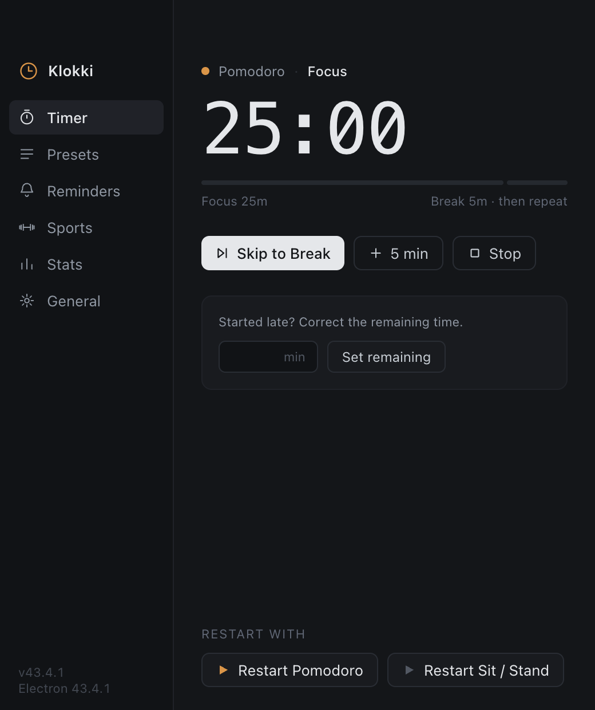
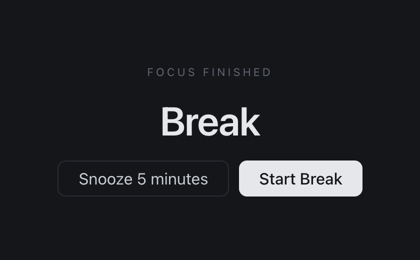
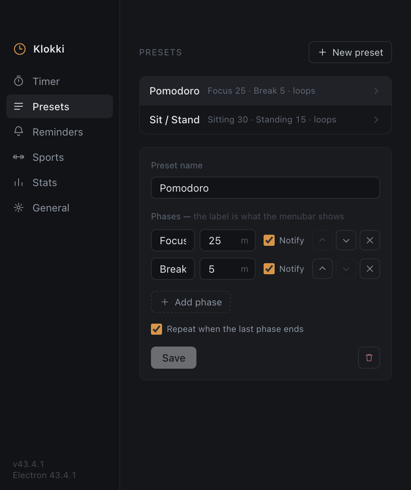
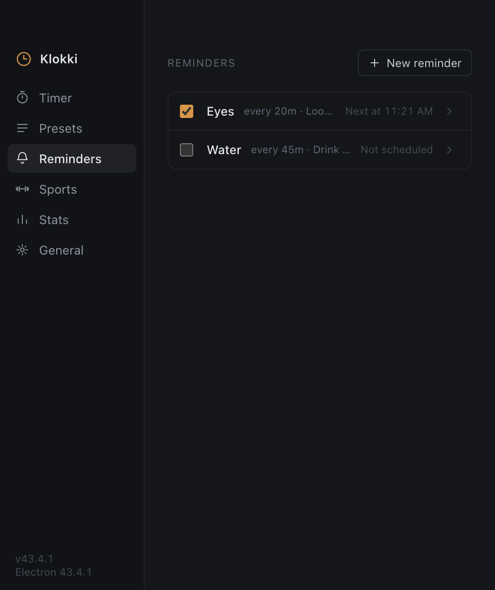
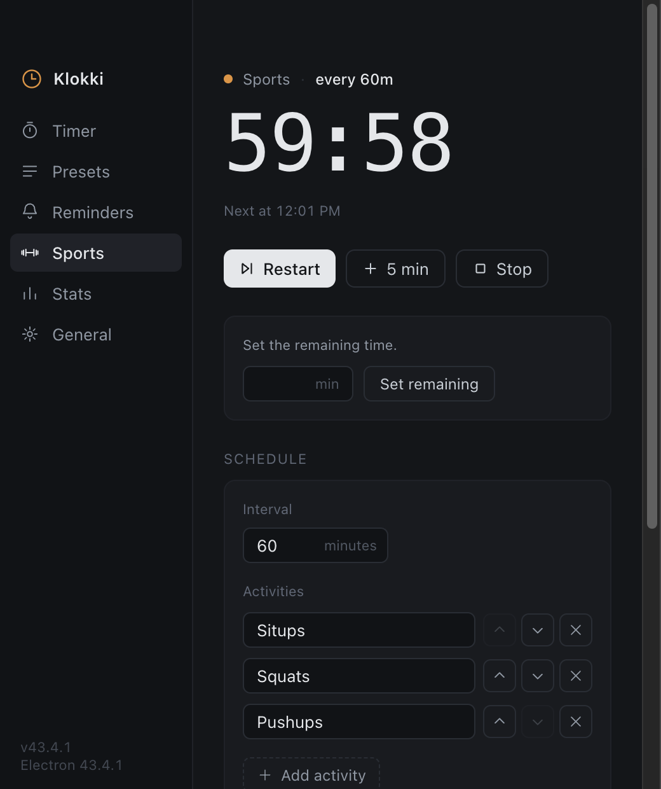
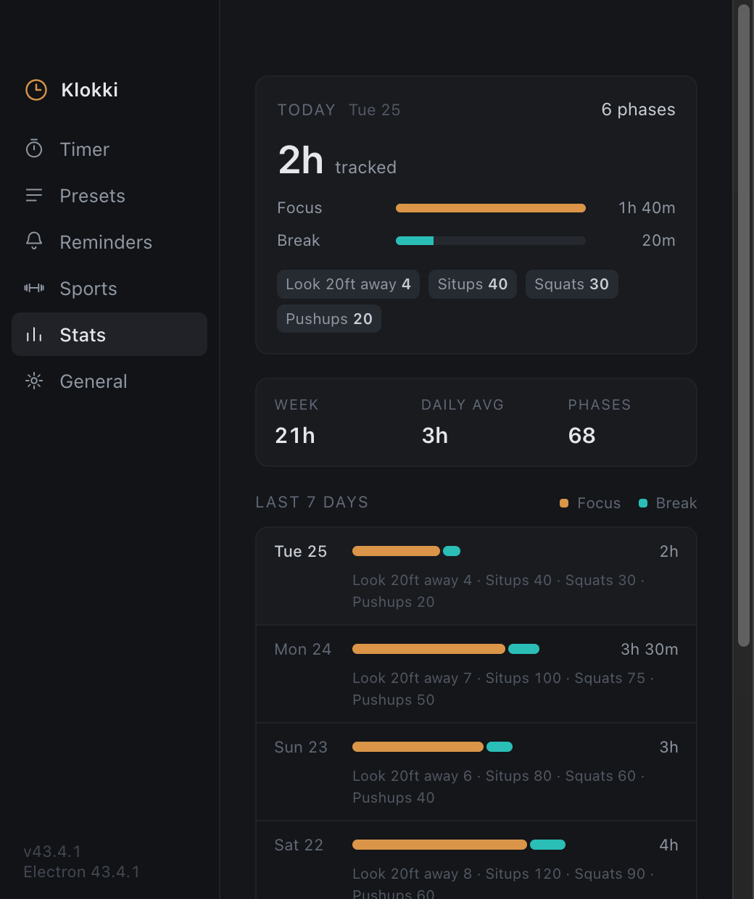

# Klokki

Klokki is a menubar interval timer for macOS. It counts down a list of phases:
Focus 25 minutes and Break 5 minutes, or Sitting 30 minutes and Standing 15
minutes, or a sequence that you write.



## What Klokki does

The timer and the clock live in the menubar. The menubar title gives the name of
the phase and the time that is left, for example `Focus 24:31`.

At the end of a phase, Klokki gives a macOS notification and an overlay. The
overlay stays in front of all other windows, and above a fullscreen app. You
must answer it. A phase with **Notify** off ends without a notification and
without an overlay.



The next phase does not start until you answer. Until then the menubar reads
`Break ready`. A break that you start five minutes late is still a full break.
The overlay, the menubar menu and the Timer pane all offer to start it.

Klokki has two more schedules that are independent of the phase timer:

- Reminders. Each reminder has its own interval and its own list of steps. One
  step fires per interval, then the list repeats. An example is `Look 20ft away`
  every 20 minutes.
- Sports. One interval asks about all activities at the same time, and records
  the quantity that you enter. The default activities are situps, squats and
  pushups.

You can start a preset, a reminder or Sports from the menubar menu. The next
interval starts when you answer the overlay that fired.

## The settings window

The window has a rail with six panes. Only the pane that you select is mounted,
and it reads the current state from the main process each time you open it.

**Presets** — the list of presets, and the editor for the selected preset. The
label of a phase is the text that the menubar shows.



**Reminders** — one row per reminder, with the interval, the steps and the next
fire time.



**Sports** — the countdown to the next request, the interval and the list of
activities.



**Stats** — the last 7 days. Klokki keeps a local log of each phase, each
reminder step and each Sports entry. The pane joins the three logs on the
calendar day and shows one row per day.



The other two panes are Timer, which shows the run in progress, and General,
which has the launch-at-login option.

## Requirements

- macOS on Apple Silicon
- Node 24 or later
- pnpm 11 or later

## Development

Install the dependencies:

```sh
pnpm install
```

Draw the menubar images. The repository holds no artwork, so this command makes
the images from code:

```sh
pnpm icons
```

Start the app with hot reload on the main process and the renderer:

```sh
pnpm dev
```

## Checks

```sh
pnpm lint        # oxlint, type-aware
pnpm typecheck   # tsc -b
pnpm vitest run  # main-process logic and renderer views
pnpm e2e         # Playwright against the real app
pnpm knip        # unused files, exports and dependencies
```

`pnpm e2e` operates the bundles in `out/`. Run `pnpm build` first, or the suite
grades the previous build.

## Screenshots

The images in this file come from the real app. To make them again after a
change to the interface:

```sh
pnpm build
pnpm screenshots
```

The script starts the bundle in `out/` with its own user-data directory, writes
a week of history into it, and captures each pane into `docs/screenshots/`. Your
own presets, reminders and history are not read and not changed.

## Install on your machine

```sh
pnpm build:mac
```

This command makes an unsigned `.dmg` in `dist/`. The app is unsigned on
purpose, because distribution is local only.

macOS refuses to open an unsigned app on the first attempt. To open it, hold
Control, click the app, and select **Open**. macOS remembers this answer.

## Status

Version 0 is feature-complete. It has these parts:

- Presets, and the editor for them
- The notification and the overlay, with snooze
- Reminders and Sports, each with its own schedule
- The local log, and the 7-day stats pane that reads it
- Launch at login
- An app icon that is drawn by code

Work is tracked as markdown files in [`issues/`](./issues). The `open/`
directory holds what is next. The `done/` directory holds what is complete.

## Architecture

The state and the clock live in the Electron main process. The renderer is a
sandboxed view that talks through one typed bridge. For the full design, read
[AGENTS.md](./AGENTS.md).
